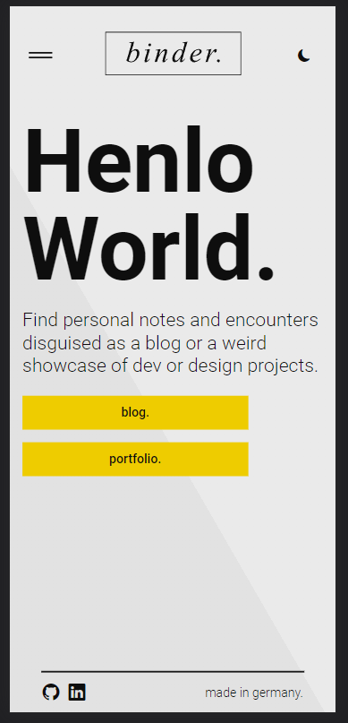
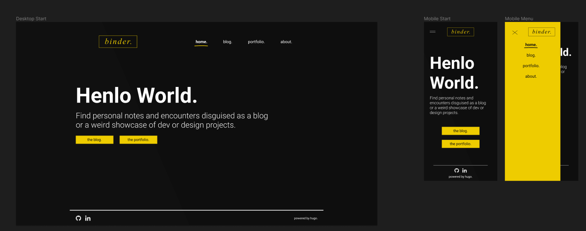
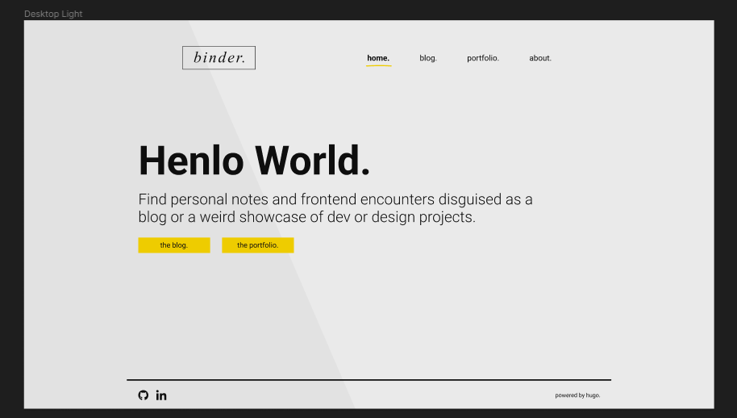
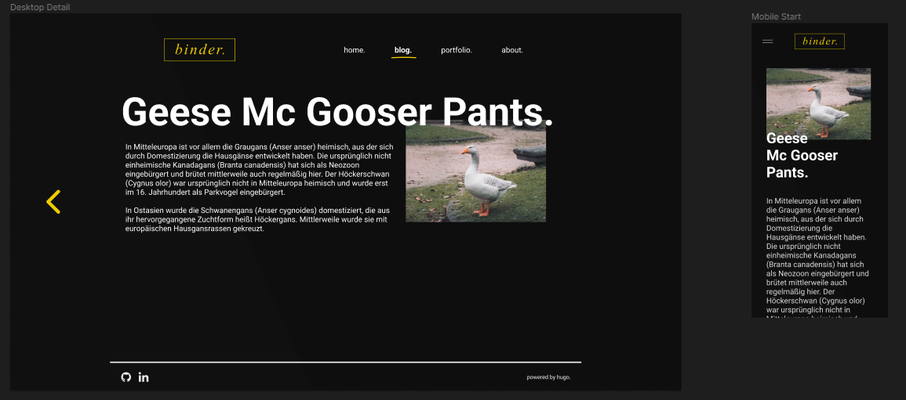
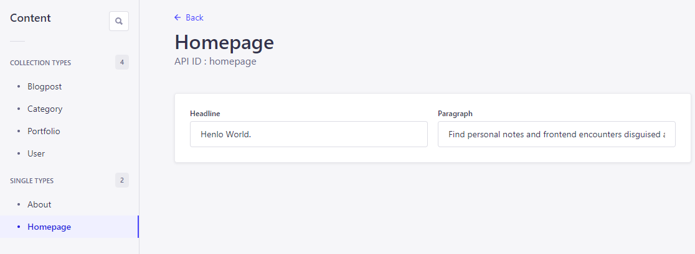

# React App for a personal blog and portfolio page.

absolute work in progress. App uses and Strapi Backend, GraphQL with Apollo.
Categories or pages are created in the backend as single types and collection
Blogposts and Portolio Pages are created in these collection and are automatically read with the graphQl queries.

Dark and light mode switch stores settings in the localstorage.

App not yet deployed.

